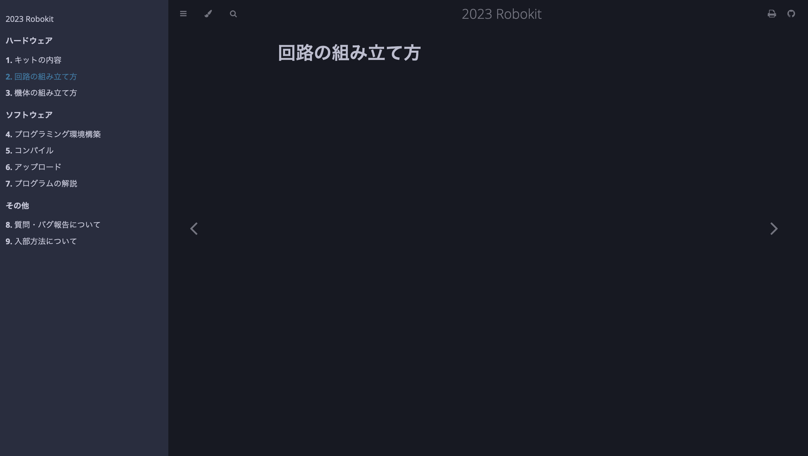
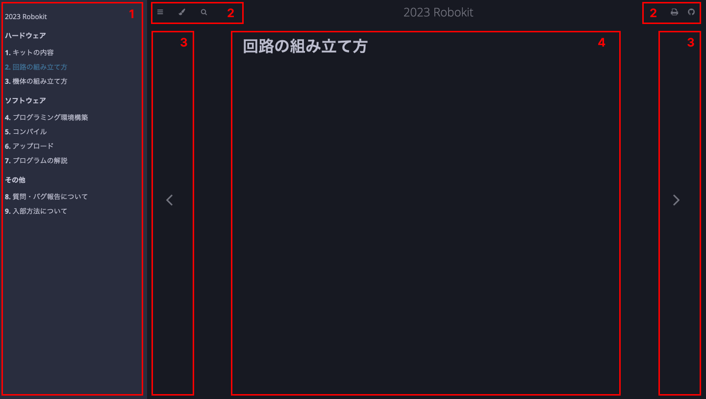

# 2023 Robokit

ロボキットへようこそ！このドキュメントは東京工業大学 ロボット技術研究会 アクア研の2023年新歓活動で配布したロボキットに関する説明をまとめたものです。ロボキット購入費の支払い方法、アクア研の連絡先、ロボット技術研究会への入部方法もこのドキュメントを参照してください。

## ロボキット購入費の支払い方法

銀行口座への振り込みでお支払いください。口座の情報は以下の通りです。

```
みずほ銀行　自由が丘支店　店番533 口座番号3064768 東工大ロボット技術研究会アクア研究
```

<!-- TODO -->
金額はn円です。依頼人名は`hogehoge`にしてください。例えば、fugafugaの場合は`Fuga Fuga`となります。mm/ddまでにお支払いください。

## 連絡先

ロボット技術研究会への連絡先は以下の通りです。

- Twitterアカウント: [@titech_ssr](https://twitter.com/titech_ssr)
- メールアドレス: [info@rogiken.org](mailto:info@rogiken.org)

アクア研への連絡先は以下の通りです。

- Twitterアカウント: [@rogy_aqua](https://twitter.com/rogy_aqua)
- メールアドレス: [rogy.aqua@gmail.com](mailto:rogy.aqua@gmail.com)

## ドキュメントの見方

以下のスクリーンショットはパソコンでこのドキュメントを開いた概観です。



画面を各部分に分解すると次のようになります。



それぞれの説明は以下の通りです。

1. このドキュメントのページ一覧。現在見ているページは青色、それ以外は白色で表されています。
2. ドキュメントのナビゲーションです。左のアイコンから順に、以下のことができます。
    1. ページ一覧とナビゲーションの表示/非表示を切り替える。
    2. テーマを変える。
    3. ドキュメント内で検索を行う。
    4. ドキュメント全体を印刷する。
    5. ドキュメントのソースコードが置かれているGitHubリポジトリを表示する。
3. 左矢印で1つ前のページ、右矢印で1つ後のページに移動します。
4. ページの本文です。

ドキュメントの見方に関するより詳細な解説は[Reading Books - mdBook Documentation](https://rust-lang.github.io/mdBook/guide/reading.html)を参照してください。
