# キットの内容物
**分からないことがあったら遠慮なく聞いてください!!**

**パーツが破損するなど、予備が必要な場合も遠慮せずに申し出てください!!**

## 初めに
### パーツは優しく扱おう
3Dプリンターで出力したパーツは一般にプロトタイピング用のパーツとして扱われており、その分他の造形方法に比べて脆いです。**やさしく扱ってください。**

### パーツ紛失に注意
小さいパーツが多いのでとても無くしやすいです(体験談)。**片付いた部屋や机の上で作業する**ことを勧めます。

### 水没厳禁
今回のキットの機械(モーター周りや端子)、回路は防水性能を持ちません。水上で想定されるちょっとした水しぶきを防ぐ程度の防御性能はありますが、DCモーターやサーボモーターが水没すると壊れます。そのため水上実験の際は**board2より上は水に付けない**ようにしましょう。

### 安全対策
モーターが高速で回転するため、回転中にパーツが外れると非常に危険です。空中で回転実験する際は**プロペラ部分をのぞきこまない**ようにしてください。もしのぞき込む場合は防護眼鏡などを着用してください。

## 機械部品
### 3Dプリンターパーツ
本キットは、3Dプリンターで制作したパーツが大部分を占めています。

3Dプリンターは、他の造形方法よりも自由な造形ができます。したがって、ロボットの中でも特に形状の制限が多い水中ロボットでは、大変重宝します。

#### 内容物
| パーツ名 | 個数 | 写真 |
| :--| :-- |:-- |
| **board1** | **2個** | 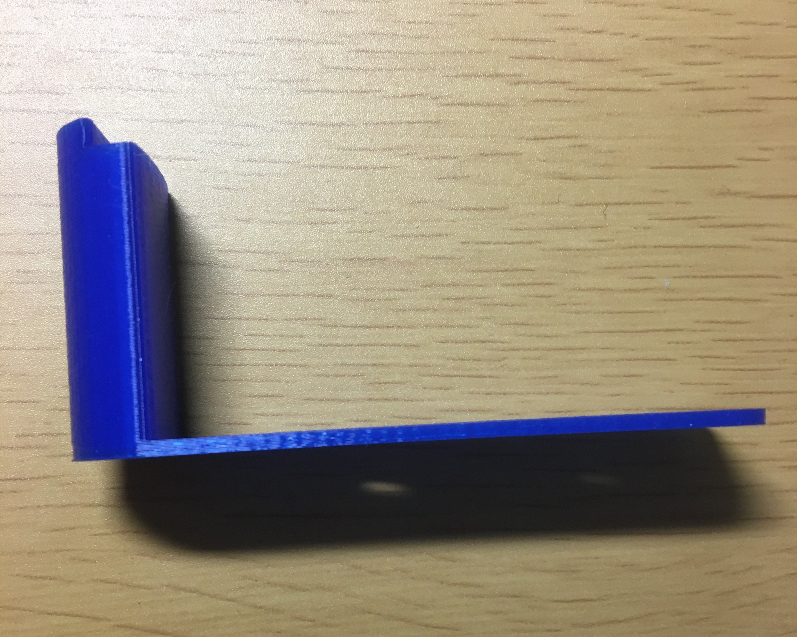 |
| **board2** | **2個** | 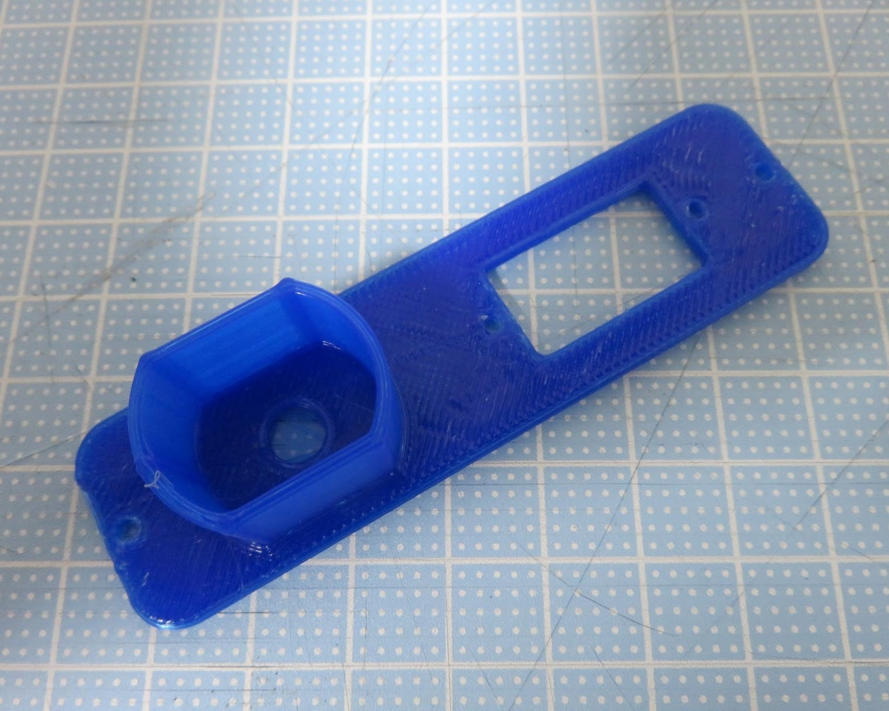 |
| **pillar1** | **2個** | 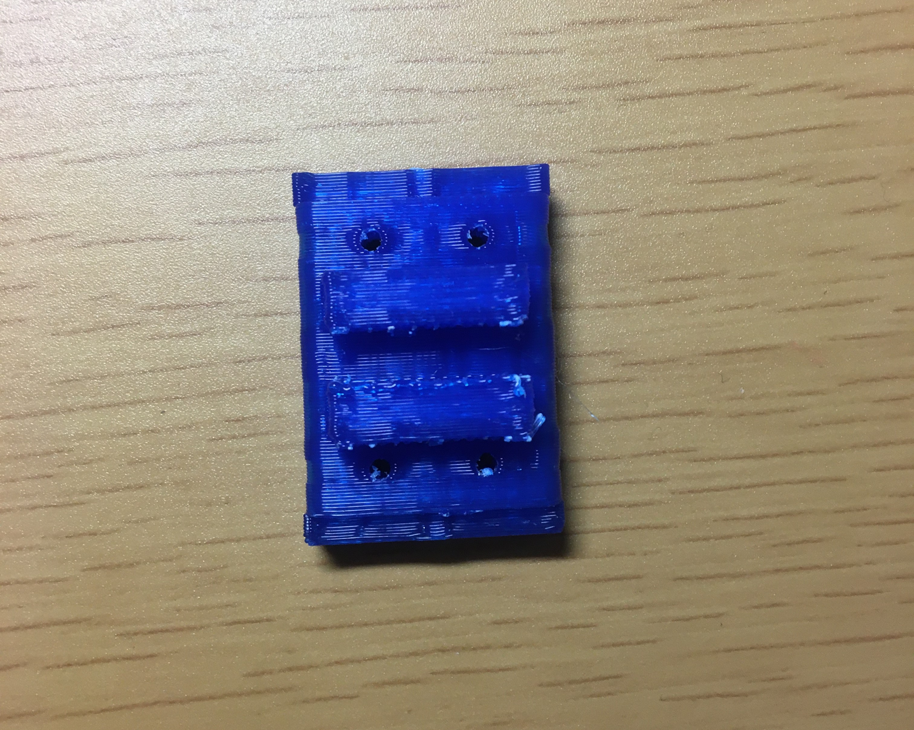 |
| **pillar2** | **4個** | 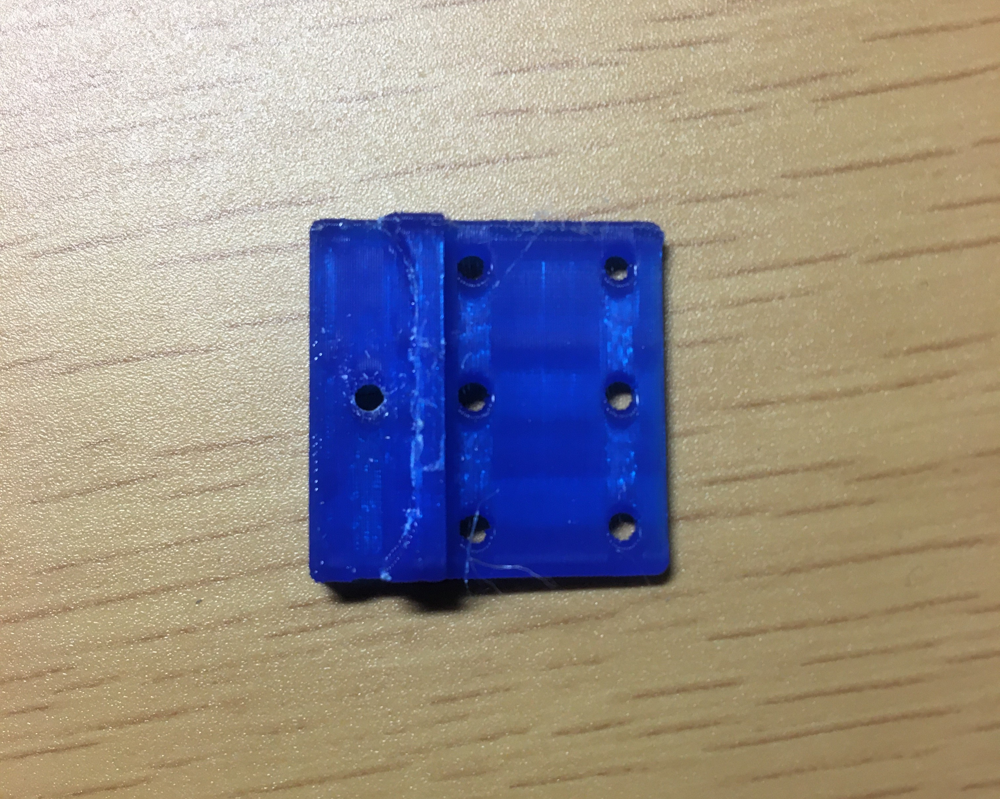 |
| **motorCover** | **2個** | 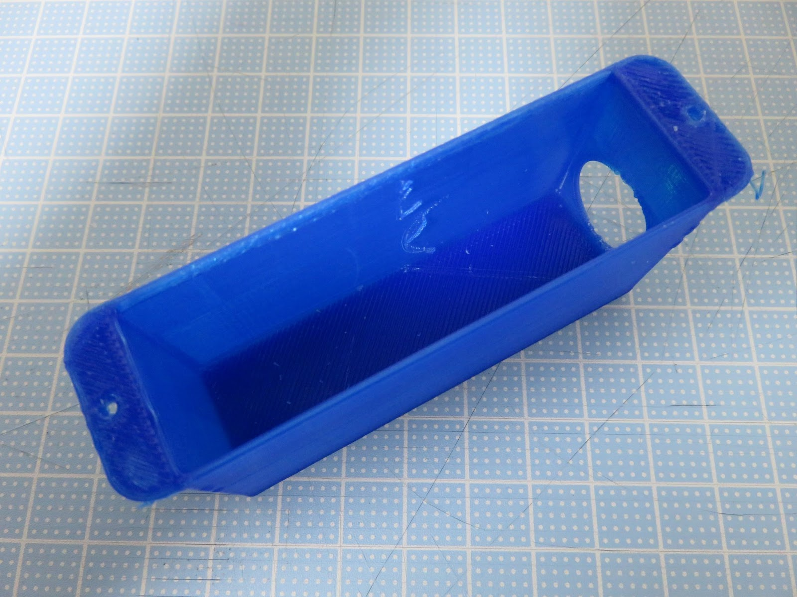 |
| **pulley1** | **2個** | 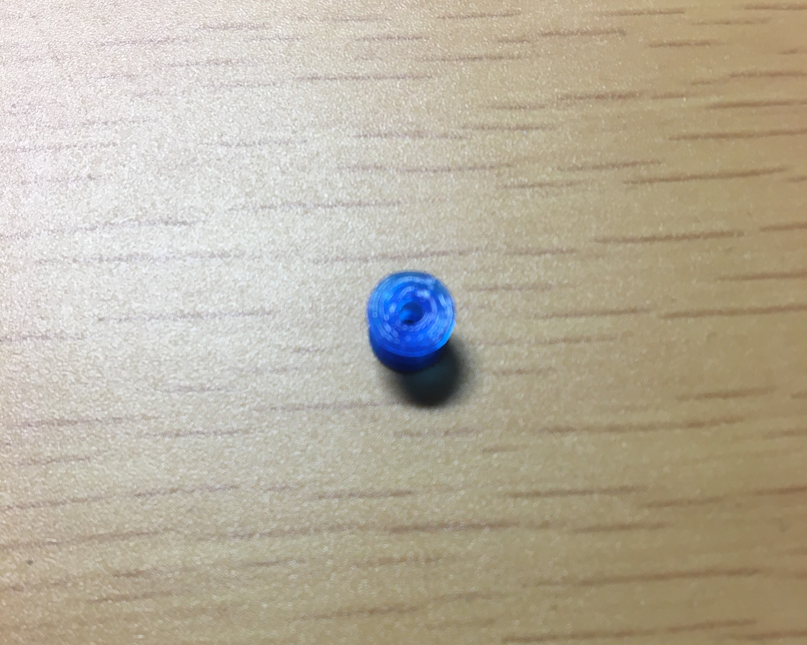 |
| **pulley2** | **2個** | 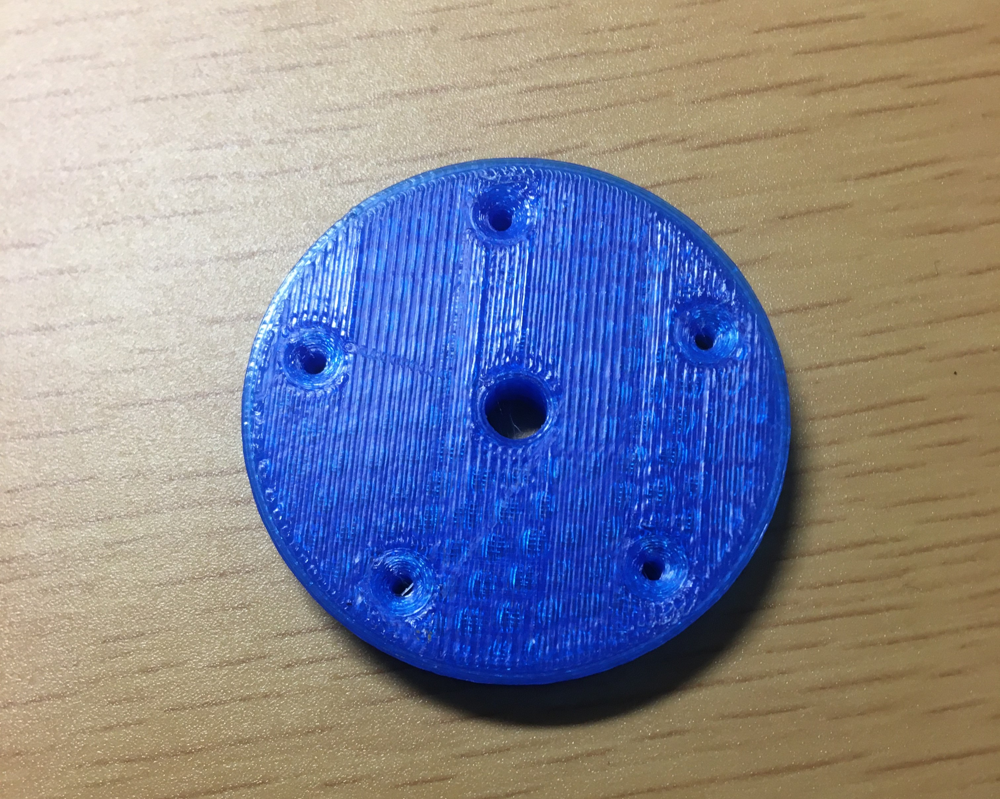 |
| **link** | **2個** | 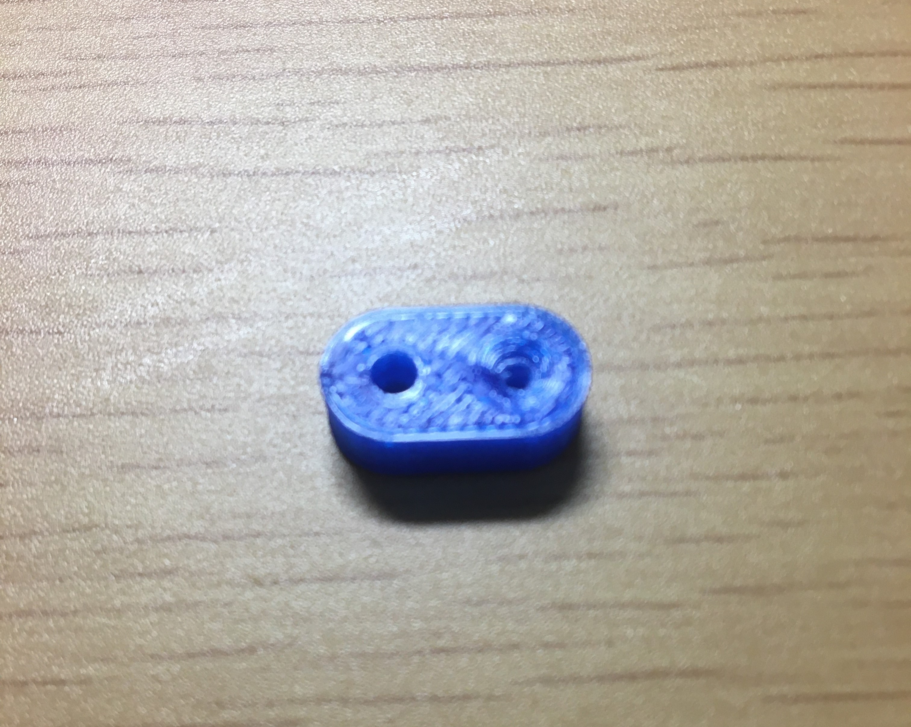 |
| **propeller1~5** | **2×5個** | 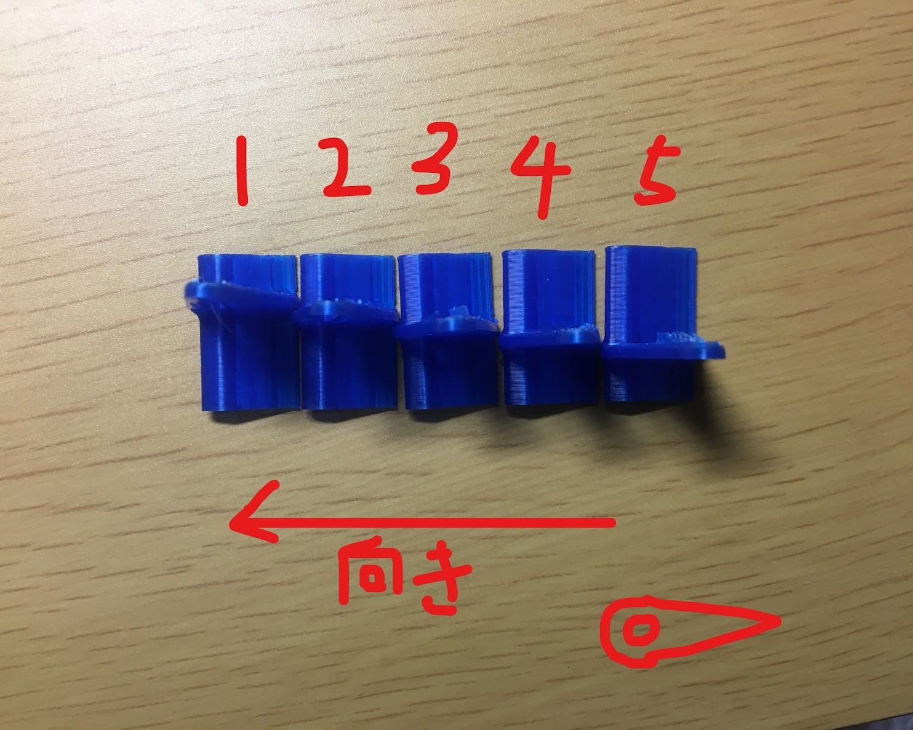 |
| **motorshaftStopper** | **2個** | 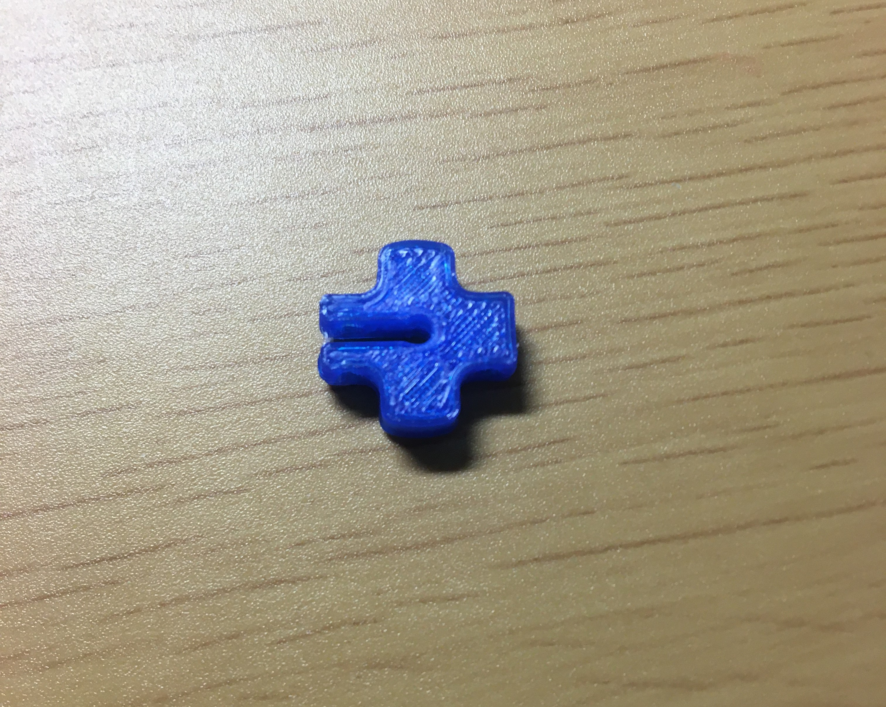 |
| **servoConnector** | **2個** | 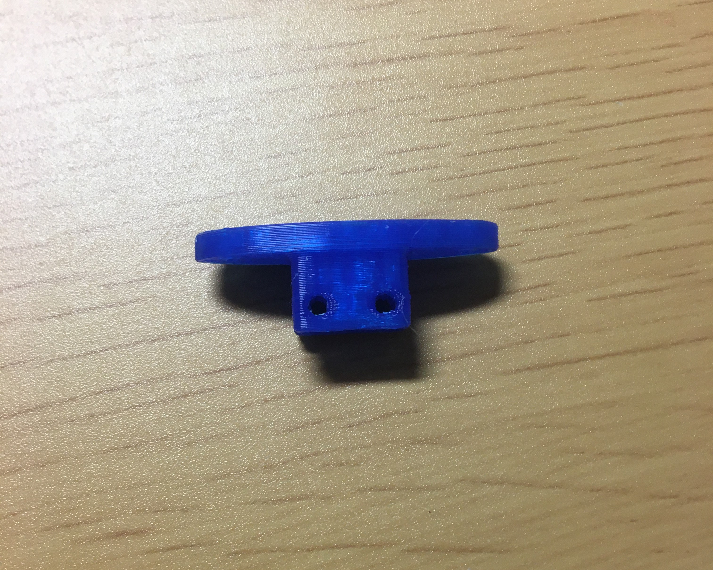 |
| **servoConnector** | **2個** |  |

### ネジ類
基本、長さの単位はすべてmm(ミリメートル)です。

#### 内容物
- ネジ
  | 種類[^bolt_type] | サイズ[^bolt_size] | 本数 |
  | :-- | :-- | :-- |
  | なべネジ | `M2*10` | 15本 |
  | なべネジ | `M2*15` | 22本 |
  | なべネジ | `M2*20` | 10本 |
  | 皿ネジ | `M2*30` | 4本 |
  | 皿ネジ | `M2*40` | 12本 |

- ナット/ワッシャー
  | 種類 | サイズ[^nut_washer_size] | 個数 |
  | :-- | :-- | :-- |
  | ナット | `M2` | 38個 |
  | ワッシャー | `M2` | 82個 |
  | ワッシャー | `M3` | 6個 |
  | スプリングワッシャー | `M2` | 35個 |

### その他
#### 内容物
| 種類 | サイズ[^shaft_size] | 個数 |
| :-- | :-- | :-- |
| シャフト | `φ2` | 2本 |
| シャフト | `φ3` | 2本 |
| フランジブッシュ | 内径 `2mm`   高さ `2mm` | 2個
| フランジブッシュ | 内径 `3mm`   高さ `2mm` | 2個
| フランジブッシュ | 内径 `3mm`   高さ `6mm` | 2個
| シリコンチューブ | 内径 `2mm` | 2本
| シリコンチューブ | 内径 `3mm` | 4本
| スズメッキ線 | 長さ `約600mm` | 1本
| 紙やすり(100番台) || 1枚
| 紙やすり(150番台) || 1枚
| 紙やすり(240番台) || 1枚

## 回路部品
### 抵抗器
| 抵抗値 | カラーコード | 本数 |
| :-- | :-- | :-- |
| `10kΩ` | 茶黑橙金 | 5本 |
| `1kΩ` | 茶黑赤金 | 6本 |
| `470Ω` | ⻩紫茶金 | 2本 |
| `220Ω` | 赤赤茶金 | 2本 |

### コネクタ/ピン
| 部品名 | ピン本数 | 個数 |
| :-- | :-- | :-- |
| XHコネクタ ベース | 2ピン | 5個 |
| XHコネクタ ハウジング | 2ピン | 5個 |
| XHコネクタ ベース | 7ピン | 2個 |
| XHコネクタ ハウジング | 7ピン | 2個 |
| VHコネクタ ベース | 2ピン | 4個 |
| VHコネクタ ハウジング | 2ピン | 4個 |
| ピンソケット | 42ピン(分割可能) | 1個 |
| ピンヘッダ | 40ピン(分割可能) | 1個 |

### その他
| 部品名 | 個数 |
| :-- | :-- |
| 積層セラミック コンデンサ `0.1μF` | 2個 |
| 電解 コンデンサ `100μF` | 1個 |
| DCモータ | 2個 |
| サーボモータ(SG-90) | 2個 |
| LED | 6個 |
| 可変抵抗器 | 1個 |
| ジョイスティック | 1個 |
| 単3電池ボックス | 2個 |
| バッテリースナップ | 1個 |
| 2SK4017(Q)   (三本のピンが生えた黒い部品) | 2個 |
| mpu6050   (小さい青い基盤) | 1個 |
| F303K8   (白いマイコン基盤) | 1個 |
| 導線 | 1セット |

[^bolt_type]: アタマが丸い方がなべネジ、アタマが平らな方が皿ネジです。

[^bolt_size]: ネジは、基本的に直径と長さによって区別され、
    - `M{直径}×{長さ}`
    - `M{直径}x{長さ}`
    - `M{直径}*{長さ}`

    などと表記します。  
    例: `M2*10` ... 直径 2mm, 長さ 10mm

[^nut_washer_size]: ナットやワッシャーは対応するネジの直径によって区別され、`M{直径}`と表記します。

[^shaft_size]: シャフトなどの丸い棒は、その直径をφという記号を使って`φ{直径}`と表記します。
