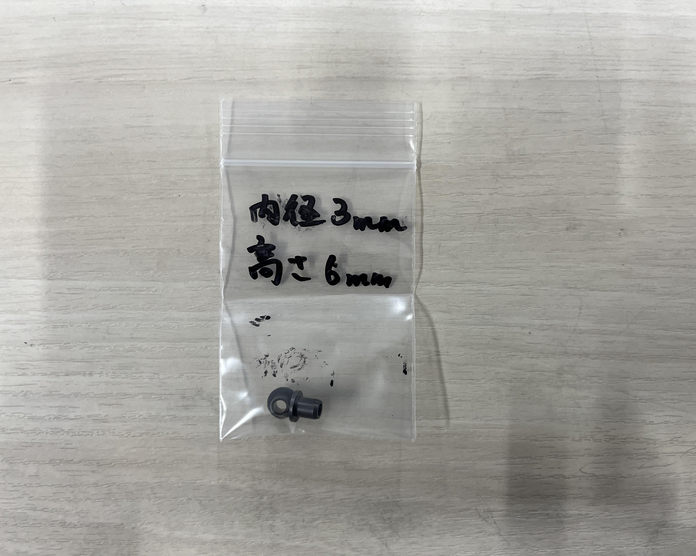
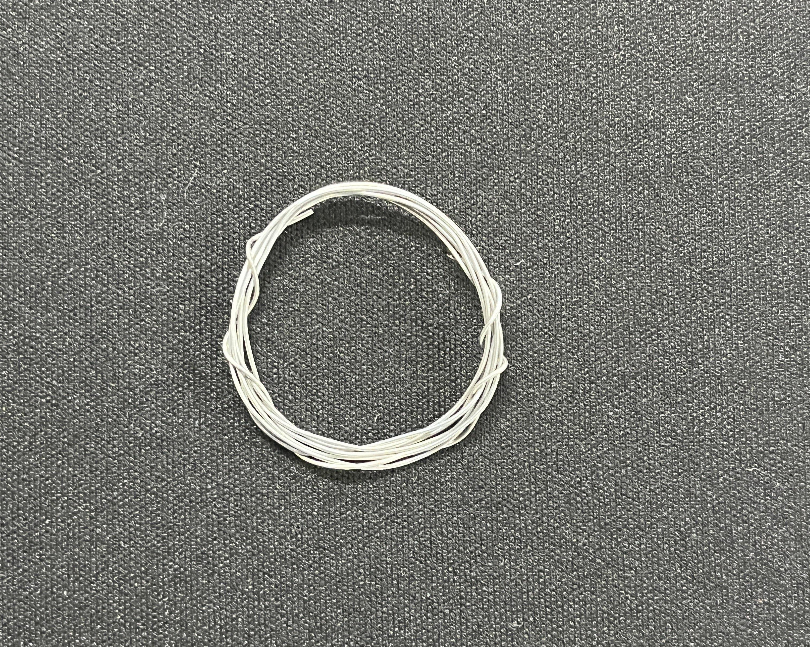
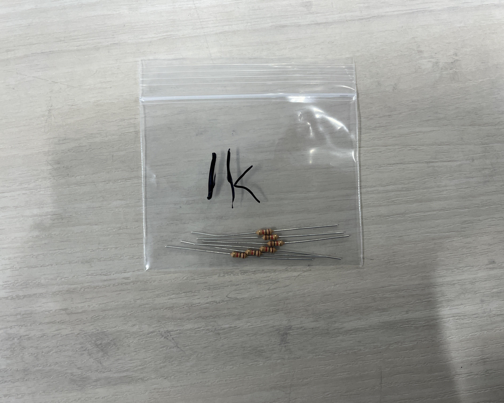
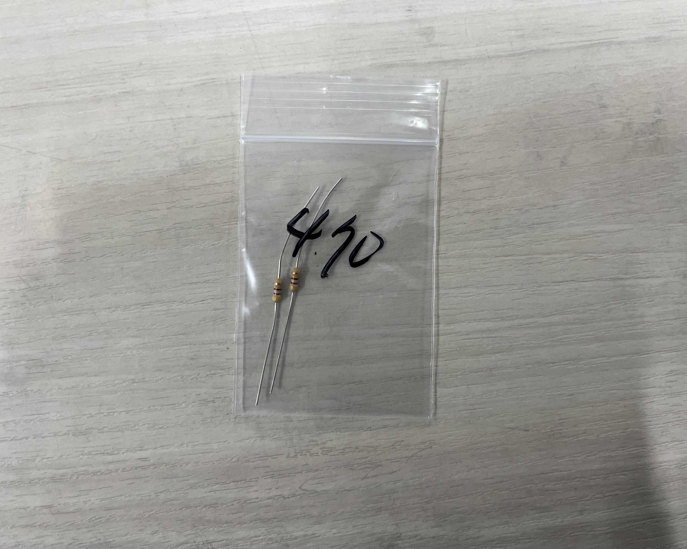
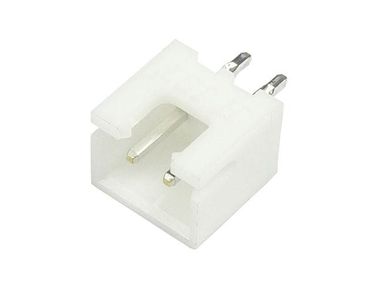
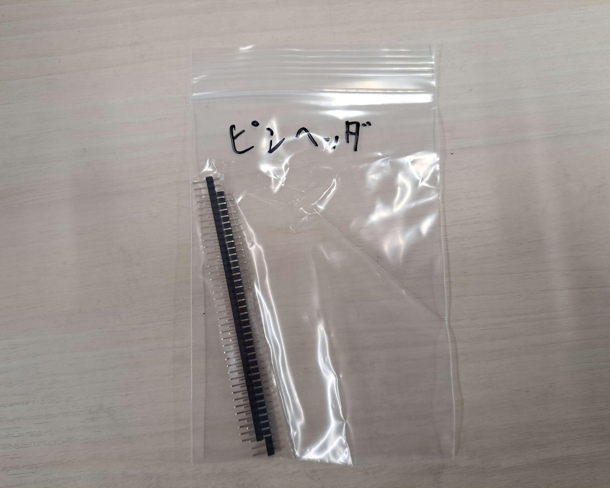
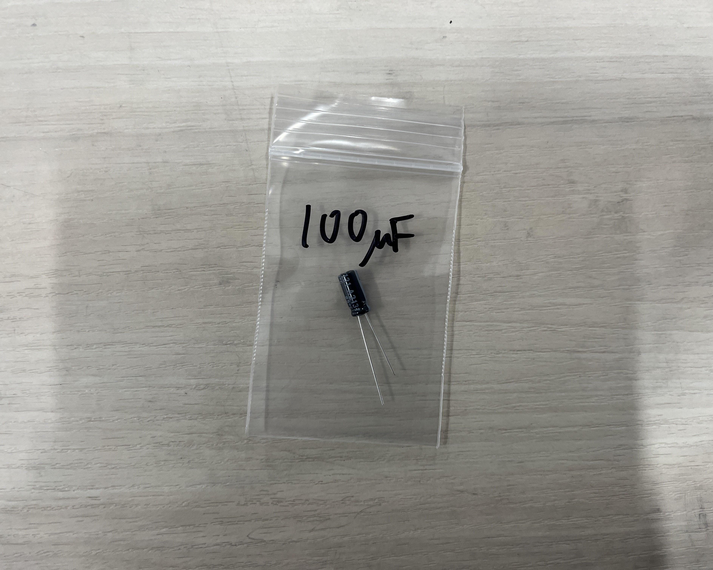
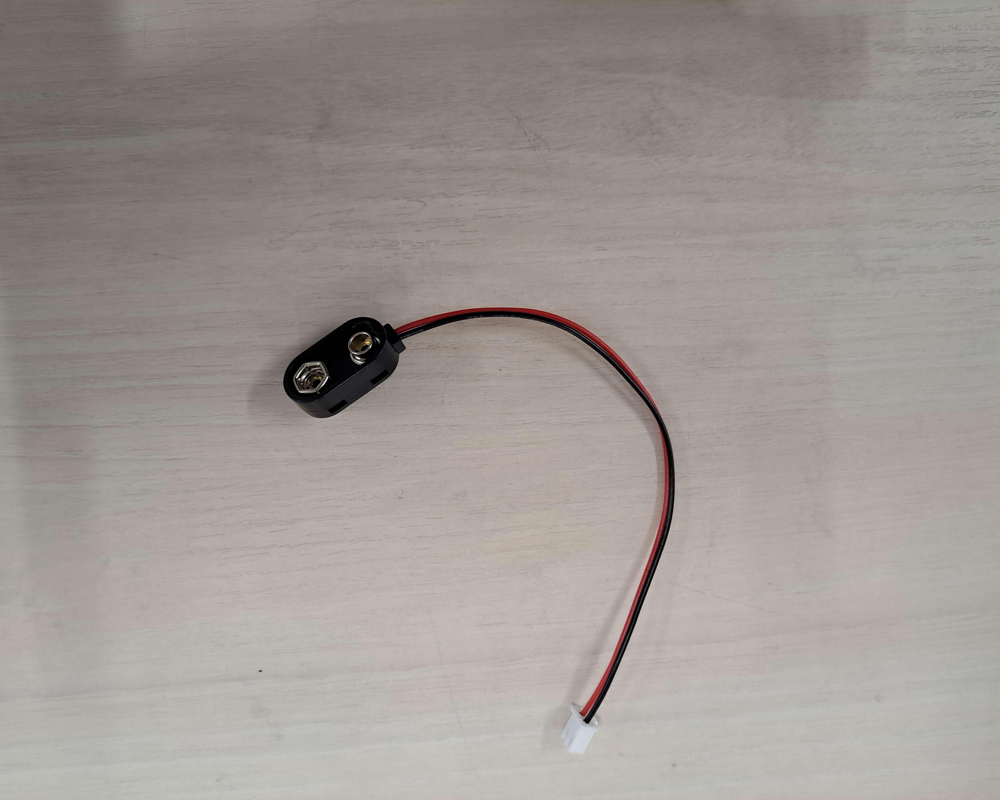
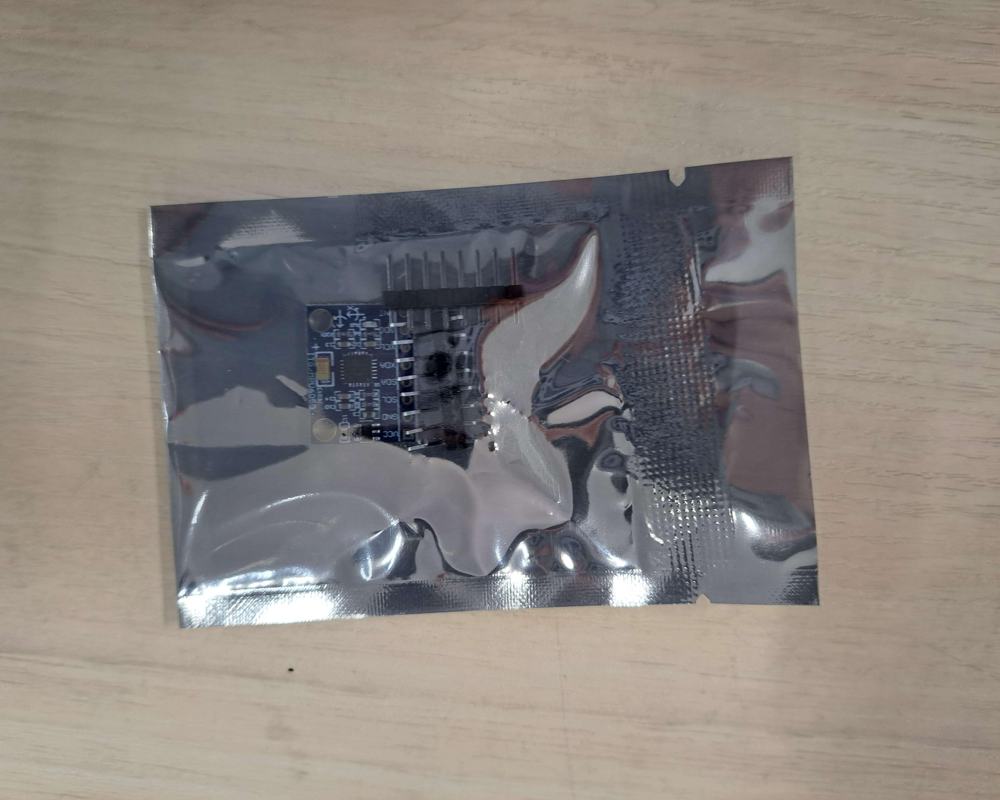

# キットの内容物
**分からないことがあったら遠慮なく聞いてください!!**

**パーツが破損するなど、予備が必要な場合も遠慮せずに申し出てください!!**

## 機械部品
### 3Dプリンターパーツ
本キットは、3Dプリンターで制作したパーツが大部分を占めています。

3Dプリンターは、他の造形方法よりも自由な造形ができます。したがって、ロボットの中でも特に形状の制限が多い水中ロボットでは、大変重宝します。

#### 内容物
| パーツ名 | 個数 | 写真 |
| :--| :-- |:-- |
| **board1** | **2個** |  |
| **board2** | **2個** |  |
| **pillar1** | **2個** |  |
| **pillar2** | **4個** |  |
| **motorCover** | **2個** |  |
| **pulley1** | **2個** |  |
| **pulley2** | **2個** |  |
| **link** | **2個** |  |
| **propeller1~5** | **2×5個** |  |
| **motorshaftStopper** | **2個** |  |
| **servoConnector** | **2個** |  |

### ネジ類
基本、長さの単位はすべてmm(ミリメートル)です。

#### 内容物
**ネジ**

| 種類[^bolt_type] | サイズ[^bolt_size] | 本数 |
| :-- | :-- | :-- |
| なべネジ | `M2*10` | 15本 |
| なべネジ | `M2*15` | 22本 |
| なべネジ | `M2*20` | 10本 |
| 皿ネジ | `M2*30` | 4本 |
| 皿ネジ | `M2*40` | 12本 |

**ナット/ワッシャー**

| 種類 | サイズ[^nut_washer_size] | 個数 |
| :-- | :-- | :-- |
| ナット | `M2` | 38個 |
| ワッシャー | `M2` | 82個 |
| ワッシャー | `M3` | 6個 |
| スプリングワッシャー | `M2` | 35個 |

[^bolt_type]: アタマが丸い方がなべネジ、アタマが平らな方が皿ネジです。

[^bolt_size]: ネジは、基本的に直径と長さによって区別され、
- `M{直径}×{長さ}`
- `M{直径}x{長さ}`
- `M{直径}*{長さ}`

などと表記します。  
例: `M2*10` ... 直径 2mm, 長さ 10mm

[^nut_washer_size]: ナットやワッシャーは対応するネジの直径によって区別され、`M{直径}`と表記します。

### その他
#### 内容物
| 種類 | サイズ[^shaft_size] | 個数 | 写真 |
| :-- | :-- | :-- | :-- |
| シャフト | `φ2` | 2本 |  |
| シャフト | `φ3` | 2本 |  |
| フランジブッシュ | 内径 `2mm`   高さ `2mm` | 2個 |  |
| フランジブッシュ | 内径 `3mm`   高さ `2mm` | 2個 |  |
| フランジブッシュ | 内径 `3mm`   高さ `6mm` | 2個 |  |
| シリコンチューブ || 2本 |  |
| スズメッキ線 | 長さ `約600mm` | 1本 |  |
| 紙やすり(100番台) || 1枚 ||
| 紙やすり(150番台) || 1枚 ||
| 紙やすり(240番台) || 1枚 ||

[^shaft_size]: シャフトなどの丸い棒は、その直径をφという記号を使って`φ{直径}`と表記します。

## 回路部品
### 抵抗器
| 抵抗値 | カラーコード | 本数 | 写真 |
| :-- | :-- | :-- | :-- |
| `10kΩ` | 茶黒橙金 | 5本 |  |
| `1kΩ` | 茶黒赤金 | 6本 |  |
| `470Ω` | ⻩紫茶金 | 2本 |  |
| `220Ω` | 赤赤茶金 | 2本 |  |

### コネクタ/ピン
| 部品名 | ピン本数 | 個数 | 写真 |
| :-- | :-- | :-- | :-- |
| XHコネクタ ポスト | 2ピン | 1個 |  |
| XHコネクタ ポスト | 3ピン | 6個 |  |
| XHコネクタ ポスト | 7ピン | 2個 |  |
| VHコネクタ ポスト | 2ピン | 4個 |  |
| ピンソケット | 最低38ピン ||  |
| ピンヘッダ |||  |

### その他
| 部品名 | 個数 | 写真 |
| :-- | :-- | :-- |
| 積層セラミック コンデンサ `0.1μF` | 2個 |  |
| 電解 コンデンサ `100μF` | 1個 |  |
| DCモータ | 2個 |  |
| [サーボモータ(SG-90)](https://akizukidenshi.com/catalog/g/gM-08761/) | 2個 |  |
| LED | 6個 |  |
| 可変抵抗器 | 1個 |  |
| ジョイスティック | 1個 |  |
| 単3電池ボックス | 2個 |  |
| バッテリースナップ | 1個 |  |
| FET(2SK4017(Q))   (三本のピンが生えた黒い部品) | 2個 |  |
| mpu6050   (小さい青い基盤) | 1個 |  |
| F303K8   (白いマイコン基盤) | 1個 |  |
| 導線 | 1セット |
