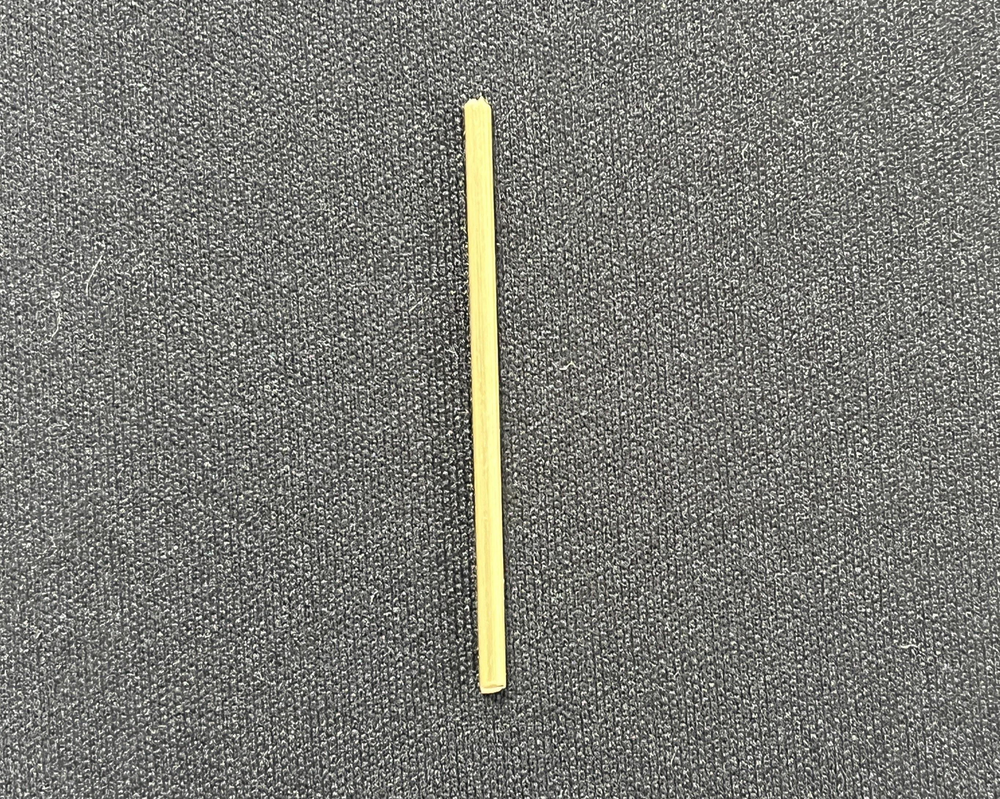
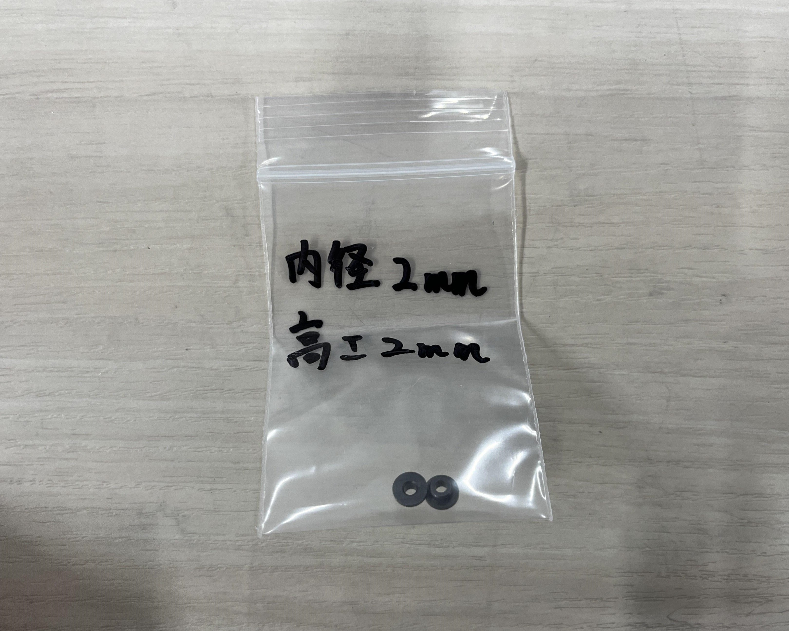
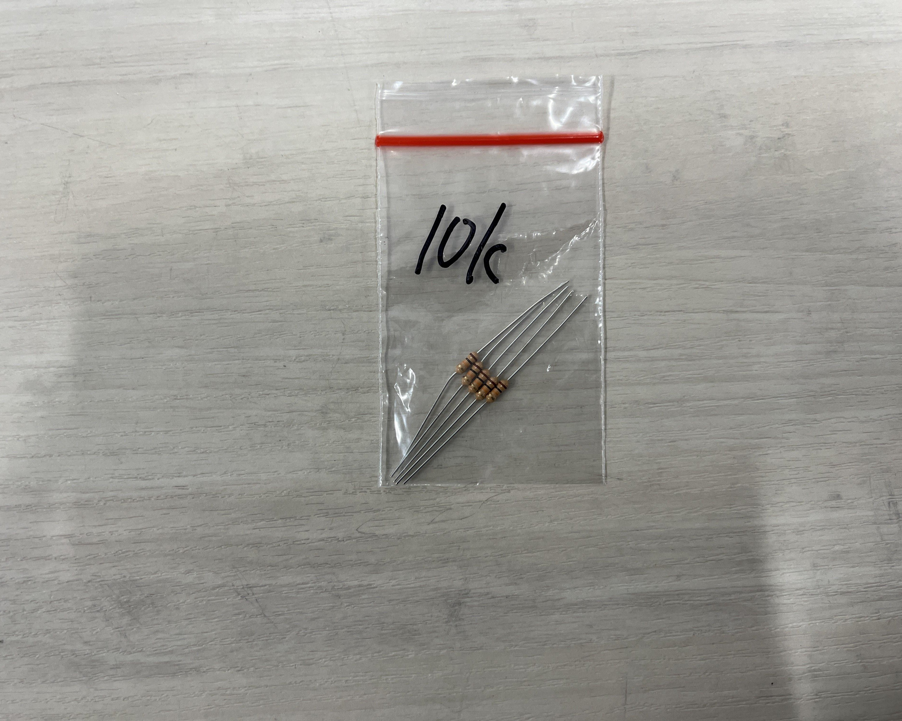
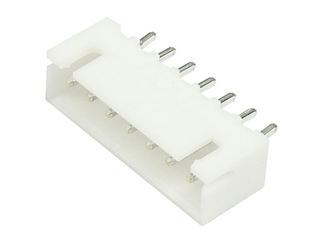
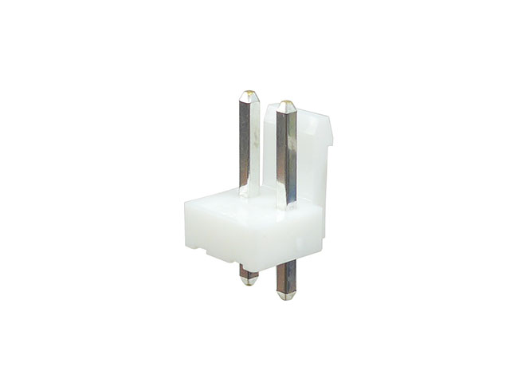
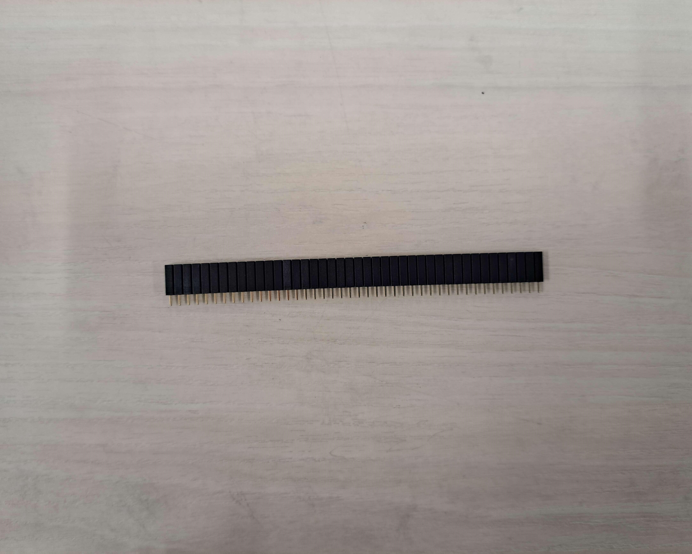
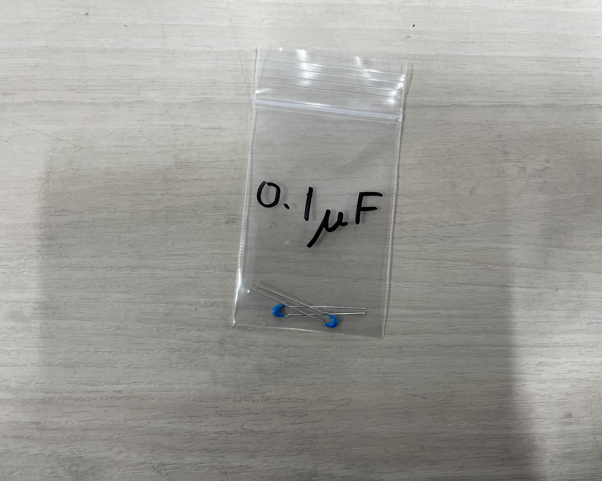
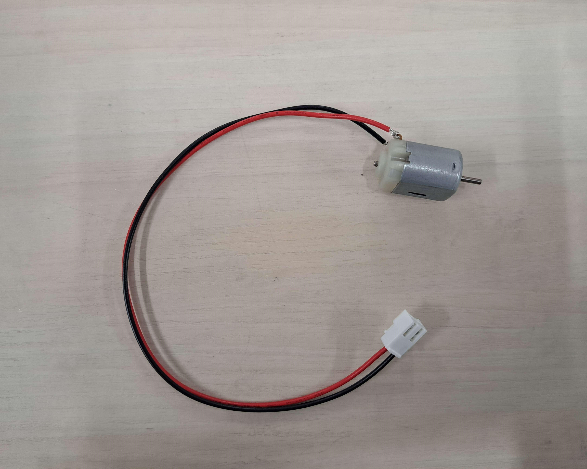
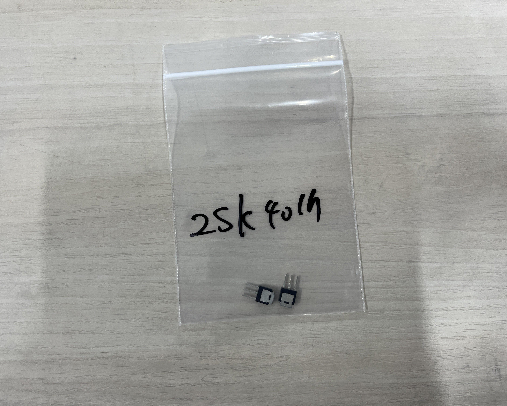

# キットの内容物
**分からないことがあったら遠慮なく聞いてください!!**

**パーツが破損するなど、予備が必要な場合も遠慮せずに申し出てください!!**

## 機械部品
### 3Dプリンターパーツ
本キットは、3Dプリンターで制作したパーツが大部分を占めています。

3Dプリンターは、他の造形方法よりも自由な造形ができます。したがって、ロボットの中でも特に形状の制限が多い水中ロボットでは、大変重宝します。

#### 内容物
| パーツ名 | 個数 | 写真 |
| :--| :-- |:-- |
| **board1** | **2個** |  |
| **board2** | **2個** |  |
| **pillar1** | **2個** |  |
| **pillar2** | **4個** |  |
| **motorCover** | **2個** |  |
| **pulley1** | **2個** |  |
| **pulley2** | **2個** |  |
| **link** | **2個** |  |
| **propeller1~5** | **2×5個** |  |
| **motorshaftStopper** | **2個** |  |
| **servoConnector** | **2個** |  |

### ネジ類
基本、長さの単位はすべてmm(ミリメートル)です。

#### 内容物
**ネジ**

| 種類[^bolt_type] | サイズ[^bolt_size] | 本数 |
| :-- | :-- | :-- |
| [なべネジ](https://www.monotaro.com/g/00010425/?t.q=%E3%81%AA%E3%81%B9%E3%81%AD%E3%81%98%E3%80%80M2) | `M2*10` | 15本 |
| [なべネジ](https://www.monotaro.com/g/00010425/?t.q=%E3%81%AA%E3%81%B9%E3%81%AD%E3%81%98%E3%80%80M2) | `M2*15` | 22本 |
| [なべネジ](https://www.monotaro.com/g/00010425/?t.q=%E3%81%AA%E3%81%B9%E3%81%AD%E3%81%98%E3%80%80M2) | `M2*20` | 10本 |
| [皿ネジ](https://www.monotaro.com/g/00424218/?t.q=%E7%9A%BF%E3%83%8D%E3%82%B8%E3%80%80m2%2030) | `M2*30` | 4本 |
| [皿ネジ](https://www.monotaro.com/g/00424218/?t.q=%E7%9A%BF%E3%83%8D%E3%82%B8%E3%80%80m%EF%BC%92%E3%80%80%EF%BC%94%EF%BC%90) | `M2*40` | 12本 |

**ナット/ワッシャー**

| 種類 | サイズ[^nut_washer_size] | 個数 |
| :-- | :-- | :-- |
| [ナット](https://www.monotaro.com/g/02448146/?t.q=%E3%83%8A%E3%83%83%E3%83%88%E3%80%80%EF%BD%8D%EF%BC%92) | `M2` | 38個 |
| [ワッシャー](https://www.monotaro.com/g/02449666/?t.q=%E3%83%AF%E3%83%83%E3%82%B7%E3%83%A3%E3%83%BC%E3%80%80%EF%BD%8D%EF%BC%92) | `M2` | 82個 |
| [ワッシャー](https://www.monotaro.com/g/02449697/?t.q=%E3%83%AF%E3%83%83%E3%82%B7%E3%83%A3%E3%83%BC%E3%80%80%EF%BD%8D%EF%BC%93) | `M3` | 6個 |
| [スプリングワッシャー](https://www.monotaro.com/g/02449767/?t.q=%E3%82%B9%E3%83%97%E3%83%AA%E3%83%B3%E3%82%B0%E3%83%AF%E3%83%83%E3%82%B7%E3%83%A3%E3%83%BC%E3%80%80%EF%BD%8D%EF%BC%92) | `M2` | 35個 |

[^bolt_type]: アタマが丸い方がなべネジ、アタマが平らな方が皿ネジです。

[^bolt_size]: ネジは、基本的に直径と長さによって区別され、
- `M{直径}×{長さ}`
- `M{直径}x{長さ}`
- `M{直径}*{長さ}`

などと表記します。  
例: `M2*10` ... 直径 2mm, 長さ 10mm

[^nut_washer_size]: ナットやワッシャーは対応するネジの直径によって区別され、`M{直径}`と表記します。

### その他
#### 内容物
| 種類 | サイズ[^shaft_size] | 個数 | 写真 |
| :-- | :-- | :-- | :-- |
| [シャフト](https://www.monotaro.com/g/01214095/?t.q=%E3%82%B7%E3%83%A3%E3%83%95%E3%83%88%E3%80%80%CF%86%EF%BC%92) | `φ2` | 2本 |  |
| [シャフト](https://www.monotaro.com/g/01214097/?t.q=%E3%82%B7%E3%83%A3%E3%83%95%E3%83%88%E3%80%80%CF%86%EF%BC%93) | `φ3` | 2本 |  |
| [フランジブッシュ](https://www.monotaro.com/g/00116854/?t.q=%E3%83%95%E3%83%A9%E3%83%B3%E3%82%B8%E3%83%96%E3%83%83%E3%82%B7%E3%83%A5%E3%80%80%EF%BC%92) | 内径 `2mm`   高さ `2mm` | 2個 |  |
| [フランジブッシュ](https://www.monotaro.com/g/00116854/?t.q=%E3%83%95%E3%83%A9%E3%83%B3%E3%82%B8%E3%83%96%E3%83%83%E3%82%B7%E3%83%A5%E3%80%80%EF%BC%92) | 内径 `3mm`   高さ `2mm` | 2個 |  |
| [フランジブッシュ](https://www.monotaro.com/g/00116854/?t.q=%E3%83%95%E3%83%A9%E3%83%B3%E3%82%B8%E3%83%96%E3%83%83%E3%82%B7%E3%83%A5%E3%80%80%EF%BC%92) | 内径 `3mm`   高さ `6mm` | 2個 |  |
| シリコンチューブ || 2本 |  |
| [スズメッキ線](https://akizukidenshi.com/catalog/g/g102220/) | 長さ `約600mm` | 1本 |  |
| [紙やすり(100番台)](https://www.monotaro.com/g/06203234/?t.q=%E7%B4%99%E3%82%84%E3%81%99%E3%82%8A%E3%80%80100) || 1枚 ||
| [紙やすり(150番台)](https://www.monotaro.com/g/06203235/) || 1枚 ||
| [紙やすり(240番台)](https://www.monotaro.com/g/06203235/) || 1枚 ||

[^shaft_size]: シャフトなどの丸い棒は、その直径をφという記号を使って`φ{直径}`と表記します。

## 回路部品
### 抵抗器
| 抵抗値 | カラーコード | 本数 | 写真 |
| :-- | :-- | :-- | :-- |
| [`10kΩ`](https://akizukidenshi.com/catalog/g/g125103/) | 茶黒橙金 | 5本 |  |
| [`1kΩ`](https://akizukidenshi.com/catalog/g/g125102/)| 茶黒赤金 | 6本 |  |
| [`470Ω`](https://akizukidenshi.com/catalog/g/g125471/) | ⻩紫茶金 | 2本 |  |
| [`220Ω`](https://akizukidenshi.com/catalog/g/g125221/) | 赤赤茶金 | 2本 |  |

### コネクタ/ピン
| 部品名 | ピン本数 | 個数 | 写真 |
| :-- | :-- | :-- | :-- |
| [XHコネクタ ポスト](https://akizukidenshi.com/catalog/g/g112247/) | 2ピン | 1個 |  |
| [XHコネクタ ポスト](https://akizukidenshi.com/catalog/g/g112248/) | 3ピン | 6個 |  |
| [XHコネクタ ポスト](https://akizukidenshi.com/catalog/g/g112252/) | 7ピン | 2個 |  |
| [VHコネクタ ポスト](https://akizukidenshi.com/catalog/g/g112815/) | 2ピン | 4個 |  |
| [ピンソケット](https://akizukidenshi.com/catalog/g/g105779/) | 最低38ピン ||  |
| [ピンヘッダ](https://akizukidenshi.com/catalog/g/g100167/) |||  |

### その他
| 部品名 | 個数 | 写真 |
| :-- | :-- | :-- |
| [積層セラミック コンデンサ `0.1μF`](https://akizukidenshi.com/catalog/g/g113582/) | 2個 |  |
| [電解 コンデンサ `100μF`](https://akizukidenshi.com/catalog/g/g117877/) | 1個 |  |
| [DCモータ](https://jp.misumi-ec.com/vona2/detail/221302669045/?rid=rid3&list=RecoCustomersViewed) | 2個 |  |
| [サーボモータ(SG-90)](https://akizukidenshi.com/catalog/g/g108761/) | 2個 |  |
| [LED](https://akizukidenshi.com/catalog/g/g111577/) | 6個 |  |
| [可変抵抗器](https://www.amazon.co.jp/KKHMF-10%E5%80%8B-B10K-%E3%83%88%E3%83%83%E3%83%97%E8%AA%BF%E6%95%B4%E3%82%B7%E3%83%B3%E3%82%B0%E3%83%AB%E5%9B%9E%E3%81%97%E3%83%AD%E3%83%BC%E3%83%AC%E3%83%83%E3%83%88%E8%BB%B8%E3%83%9C%E3%83%AA%E3%83%A5%E3%83%BC%E3%83%A0-%E3%83%9D%E3%83%86%E3%83%B3%E3%82%B7%E3%83%A7%E3%83%A1%E3%83%BC%E3%82%BF10K%E3%82%AA%E3%83%BC%E3%83%A0/dp/B073LQ38LL/ref=sr_1_3?adgrpid=117166334578&hvadid=666190999667&hvdev=c&hvqmt=b&hvtargid=kwd-441685818459&hydadcr=6306_13366777&jp-ad-ap=0&keywords=%E5%8F%AF%E5%A4%89%E6%8A%B5%E6%8A%97%2Bb10k&qid=1707569492&sr=8-3&th=1) | 1個 |  |
| [ジョイスティック](https://www.amazon.co.jp/EasyWordMall-Dual-axis-Joystick-%E3%82%B8%E3%83%A7%E3%82%A4%E3%82%B9%E3%83%86%E3%82%A3%E3%83%83%E3%82%AF-%E3%83%A2%E3%82%B8%E3%83%A5%E3%83%BC%E3%83%ABArduino%E7%94%A8/dp/B016PXVH66/ref=sr_1_3?adgrpid=116133821455&hvadid=666190684262&hvdev=c&hvqmt=b&hvtargid=kwd-333977668923&hydadcr=2902_13693353&jp-ad-ap=0&keywords=%E3%82%B8%E3%83%A7%E3%82%A4%E3%82%B9%E3%83%86%E3%82%A3%E3%83%83%E3%82%AF%E3%83%A2%E3%82%B8%E3%83%A5%E3%83%BC%E3%83%AB&qid=1707536978&sr=8-3&th=1) | 1個 |  |
| [単3電池ボックス](https://www.monotaro.com/p/5035/1194/?utm_id=bi_pla&cq_plt=bp&cq_net=o&utm_medium=cpc&utm_source=bing&utm_campaign=shopping_413560246&utm_content=50351194&msclkid=3f2e8ff441b51fb5983cea32b31831de&utm_term=4588743062377281) | 2個 |  |
| [バッテリースナップ](https://akizukidenshi.com/catalog/g/g100207/) | 1個 |  |
| [FET(2SK4017(Q))   (三本のピンが生えた黒い部品)](https://akizukidenshi.com/catalog/g/g107597/) | 2個 |  |
| [mpu6050   (小さい青い基盤)](https://www.amazon.co.jp/ps61003-MPU-6050-%E4%BD%BF%E7%94%A8-%EF%BC%93%E8%BB%B8%E3%82%B8%E3%83%A3%E3%82%A4%E3%83%AD%E3%82%B9%E3%82%B3%E3%83%BC%E3%83%97%E3%83%BB%EF%BC%93%E8%BB%B8%E5%8A%A0%E9%80%9F%E5%BA%A6%E3%82%BB%E3%83%B3%E3%82%B5%E3%83%BC-%E3%83%A2%E3%82%B8%E3%83%A5%E3%83%BC%E3%83%AB/dp/B008BOPN40/ref=sr_1_5?__mk_ja_JP=%E3%82%AB%E3%82%BF%E3%82%AB%E3%83%8A&crid=378FNV5H963CW&keywords=mpu6050&qid=1707537587&sprefix=mpu6050%2Caps%2C170&sr=8-5) | 1個 |  |
| [F303K8   (白いマイコン基盤)](https://akizukidenshi.com/catalog/g/g110172/) | 1個 |  |
| 導線 | 1セット |
