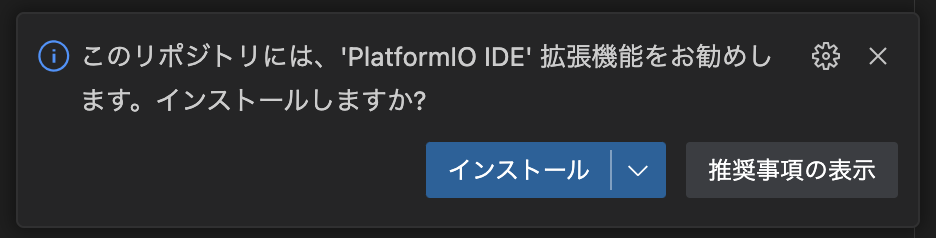

# プログラミング環境構築

ここではロボキットのプログラムを書き、そのプログラムでロボキットを動かすための環境構築を紹介します。概要は次の通りです。

<!-- no toc -->
1. [VSCodeをインストールする](#1-vscodeをインストールする)
2. [プログラムをダウンロードする](#2-プログラムをダウンロードする)
3. [VSCodeでプログラムを開く](#3-vscodeでプログラムを開く)
4. [必要なVSCodeの拡張機能をインストールする](#4-必要なvscodeの拡張機能をインストールする)

ここではMac, Windowsでの環境構築について紹介します。環境構築でわからないところがある場合は[質問・バグ報告について](./08-contributing.md)を参照してください。

## 1: VSCodeをインストールする

[VSCode](https://code.visualstudio.com/)(**V**isual **S**tudio **Code**)とは、microsoftが無料で公開しているコードエディタです。プログラミングを行う際はこのエディタを使うことが多いです。

まずはインストールに必要なファイルをダウンロードします。次のURLを開いてください。

[https://code.visualstudio.com/](https://code.visualstudio.com/)

VSCodeをインストールするのに適切なファイルをダウンロードするボタンがページの真ん中あたりに表示されています。Macの場合は以下のようなものです。


このボタンを押すとダウンロードが始まります。ダウンロード後の作業はOSごとに手順が違うので注意してください。

### Windows

ダウンロードされたものはVSCodeのインストーラです。ファイルを開いて実行すると、VSCodeをインストールするためのウィンドウが開きます。

以降はウィンドウの指示に従って進めてください。オプションが何個かありますが、迷った場合/わからなかった場合はとりあえずチェックを入れておくのが吉です。

ダウンロード後のスクリーンショット付きの説明は[VSCode | Visual Studio Codeのダウンロードとインストール #Visual Studio Codeをインストールする](https://www.javadrive.jp/vscode/install/index1.html#section2)を参照してください。

### Mac

ダウンロードされたものはVSCodeアプリのzipファイルです。展開すると`Visual Studio Code.app`という名前のファイルができます。このファイルを「アプリケーション」フォルダに移動させてから開いてください。

開く際に警告が出る可能性がありますが、構わず進めてください。

ダウンロード後のスクリーンショット付きの説明は[MacOSでVisual Studio Codeをインストールする手順 - Qiita #3. ダウンロードしたファイルを開く（解凍する）](https://qiita.com/watamura/items/51c70fbb848e5f956fd6#3-%E3%83%80%E3%82%A6%E3%83%B3%E3%83%AD%E3%83%BC%E3%83%89%E3%81%97%E3%81%9F%E3%83%95%E3%82%A1%E3%82%A4%E3%83%AB%E3%82%92%E9%96%8B%E3%81%8F%E8%A7%A3%E5%87%8D%E3%81%99%E3%82%8B)を参照してください。

## 2: プログラムをダウンロードする

[](https://github.com/rogy-AquaLab/2023_robokit/archive/refs/heads/main.zip)

↑のバッジを押すとzipファイルのダウンロードが始まります。展開して得られるフォルダの中にプログラムが入っています。以降、このフォルダは`ダウンロード`フォルダの中にあるものとします。

## 3: VSCodeでプログラムを開く

```shell
code Downloads/2023_robokit-main
```

## 4: 必要なVSCodeの拡張機能をインストールする

VSCodeでは拡張機能と呼ばれるものをインストールしてVSCodeをより多機能にすることができます。ここでは以下の2つの拡張機能をインストールします。

1. [Japanese Language Pack for Visual Studio Code](https://marketplace.visualstudio.com/items?itemName=MS-CEINTL.vscode-language-pack-ja)
2. [PlatformIO IDE](https://marketplace.visualstudio.com/items?itemName=platformio.platformio-ide)

> **注意**
> VSCodeをインストールした後にVSCodeの日本語化を行なっている場合は、1つ目の拡張機能が既にインストールされています。2つ目の拡張機能を入れるところまで飛ばしてください。

まずは1つ目の拡張機能を入れます。最初にVSCodeでプログラムを開くと、↓のようなポップアップがウィンドウ右下に出てきます。


まずは日本語の言語パックをインストールしてVSCodeを再起動させましょう。再起動後、VSCodeの言語が日本語になっているはずです。

次に2つ目の拡張機能を入れます。日本語化できたのち、ウィンドウ右側には次のようなポップアップが表示されるはずです。



インストール後、必要に応じてVSCodeの再起動などを行なってください。VSCodeのウィンドウ左側にのアイコンが表示されていれば環境構築は完了です。

## 参考

- [VSCode | Visual Studio Codeのダウンロードとインストール](https://www.javadrive.jp/vscode/install/index1.html)
- [MacOSでVisual Studio Codeをインストールする手順 - Qiita](https://qiita.com/watamura/items/51c70fbb848e5f956fd6)
- [Setting up Visual Studio Code](https://code.visualstudio.com/docs/setup/setup-overview)
- [Running Visual Studio Code on Linux](https://code.visualstudio.com/docs/setup/linux)
- [Running Visual Studio Code on macOS](https://code.visualstudio.com/docs/setup/mac)
- [Running Visual Studio Code on Windows](https://code.visualstudio.com/docs/setup/windows)
- [visual-studio-code — Homebrew Formulae](https://formulae.brew.sh/cask/visual-studio-code)
- [PlatformIO IDE for VSCode — PlatformIO stable documentation #Installation](https://docs.platformio.org/en/stable/integration/ide/vscode.html#installation)
