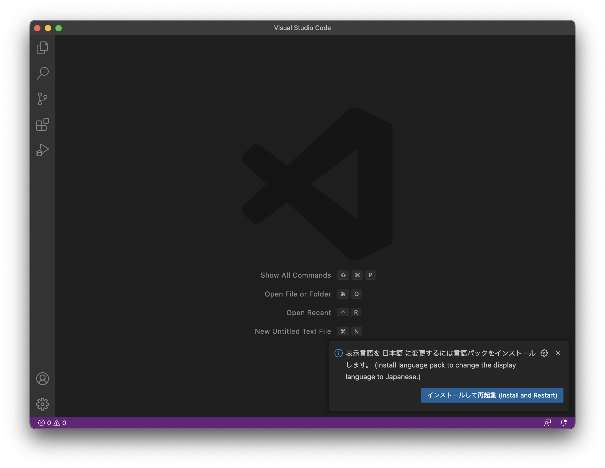
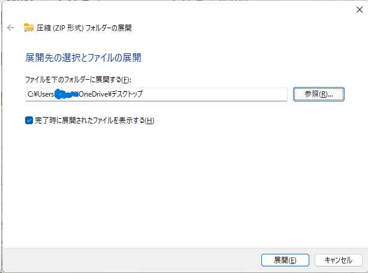
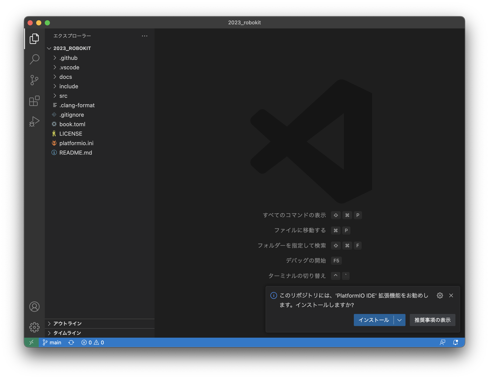

# プログラミング環境構築

ここではロボキットのプログラムを書き、そのプログラムでロボキットを動かすための環境構築を紹介します。概要は次の通りです。

<!-- no toc -->
1. [VSCodeをインストールする](#1-vscodeをインストールする)
2. [VSCodeを開く](#2-vscodeを開く)
3. [プログラムを開く](#3-プログラムを開く)
4. [必要な拡張機能をインストールする](#4-必要な拡張機能をインストールする)

ここではMac, Windowsでの環境構築について紹介します。環境構築でわからないところがある場合は[質問・バグ報告について](./08-contributing.md)を参照してください。

## 1: VSCodeをインストールする

[VSCode](https://code.visualstudio.com/)(**V**isual **S**tudio **Code**)とは、microsoftが無料で公開しているコードエディタです。プログラミングを行う際はこのエディタを使うことが多いです。

まずはインストールに必要なファイルをダウンロードします。次のURLを開いてください。

<a href="https://code.visualstudio.com/" target="_blank">https://code.visualstudio.com/</a>

VSCodeをインストールに適切なファイルをダウンロードするボタンがページの真ん中あたりに表示されています。Macの場合は以下のようなものです。

このようなボタンを押すとダウンロードが始まります。ダウンロード後の作業はOSごとに手順が違うので注意してください。

### Windows

ダウンロードされたものはVSCodeのインストーラです。ファイルを開いて実行すると、VSCodeをインストールするためのウィンドウが開きます。
以降はウィンドウの指示に従って進めてください。

ダウンロード後のスクリーンショット付きの説明は[VSCode | Visual Studio Codeのダウンロードとインストール #Visual Studio Codeをインストールする](https://www.javadrive.jp/vscode/install/index1.html#section2)を参照してください。

オプションが何個かありますが、迷った場合/わからなかった場合はとりあえずチェックを入れておくのが吉です。

### Mac

ダウンロードされたものはVSCodeアプリのzipファイルです。展開すると`Visual Studio Code.app`という名前のファイルができます。このファイルを「アプリケーション」フォルダに移動させてから開いてください。

開く際に警告が出る可能性がありますが、構わず進めてください。

ダウンロード後のスクリーンショット付きの説明は[MacOSでVisual Studio Codeをインストールする手順 - Qiita #3. ダウンロードしたファイルを開く（解凍する）](https://qiita.com/watamura/items/51c70fbb848e5f956fd6#3-%E3%83%80%E3%82%A6%E3%83%B3%E3%83%AD%E3%83%BC%E3%83%89%E3%81%97%E3%81%9F%E3%83%95%E3%82%A1%E3%82%A4%E3%83%AB%E3%82%92%E9%96%8B%E3%81%8F%E8%A7%A3%E5%87%8D%E3%81%99%E3%82%8B)を参照してください。

## 2: VSCodeを開く

インストールが完了したらVSCodeを起動します。最初に表示されるウィンドウは↓のようになっているはずです。

画面右下にある「インストールして再起動」のボタンを押してください。VSCodeが再起動後、日本語化されます。

## 3: プログラムを開く

まずはロボキットを動かすプログラムをダウンロードします。

↑のバッジを押すとzipファイルのダウンロードが始まります。展開して得られるフォルダの中にプログラムが入っています。(zipファイルは削除しても構いません。)

>### zipファイル展開の流れ（わかる人はとばして大丈夫です。）
>#### Windows
>1. zipをダウンロードすると右上にタブが出てくるのでダウンロードが終わってから"omniboat_robokit_main.zip"のzipファイルににポインタを当ててファイルマークをクリックしてください。
（またはエクスプローラーのダウンロードからzipファイルを探してください。）
>
>    
>
>2. ファイルを右クリックして「すべて展開」を選択してください。
>
>     &emsp; 
>
>3. 「参照」を選択して展開先をデスクトップに変更し、右下の「展開」をクリックしてください。（別の場所が良い人は好きにして大丈夫です。）
>
>     &emsp; 
>
>#### Mac
>1. ダウンロードフォルダからデスクトップフォルダに移動させてください。
>
>2. zipファイルをダブルクリックしてください。展開が完了します。

続いて、展開したフォルダをVSCodeで開きます。Windowsの方はウィンドウ左上のメニュー、Macの方は画面左上のメニューから *ファイル>フォルダーを開く* を選択してください。フォルダを選ぶためのウィンドウが出てくるので、先程zipファイルを展開して得たフォルダを選択して開いてください。

## 4: 必要な拡張機能をインストールする

フォルダをVSCodeで開くと、以下のようなウィンドウが表示されるはずです。

画面右下の「インストール」ボタンを押して、プログラムを実行するのに必要なVSCodeの拡張機能をインストールします。

> VSCodeでは拡張機能と呼ばれるものをインストールしてVSCodeをより多機能にすることができます。ここでインストールしているのは[PlatformIO IDE](https://marketplace.visualstudio.com/items?itemName=platformio.platformio-ide)という拡張機能です。

インストール後、必要に応じてVSCodeの再起動などを行なってください。VSCodeのウィンドウ左側にのアイコンが表示されていれば環境構築は完了です。

## 参考

- [VSCode | Visual Studio Codeのダウンロードとインストール](https://www.javadrive.jp/vscode/install/index1.html)
- [MacOSでVisual Studio Codeをインストールする手順 - Qiita](https://qiita.com/watamura/items/51c70fbb848e5f956fd6)
- [Setting up Visual Studio Code](https://code.visualstudio.com/docs/setup/setup-overview)
- [Running Visual Studio Code on Linux](https://code.visualstudio.com/docs/setup/linux)
- [Running Visual Studio Code on macOS](https://code.visualstudio.com/docs/setup/mac)
- [Running Visual Studio Code on Windows](https://code.visualstudio.com/docs/setup/windows)
- [visual-studio-code — Homebrew Formulae](https://formulae.brew.sh/cask/visual-studio-code)
- [PlatformIO IDE for VSCode — PlatformIO stable documentation #Installation](https://docs.platformio.org/en/stable/integration/ide/vscode.html#installation)
