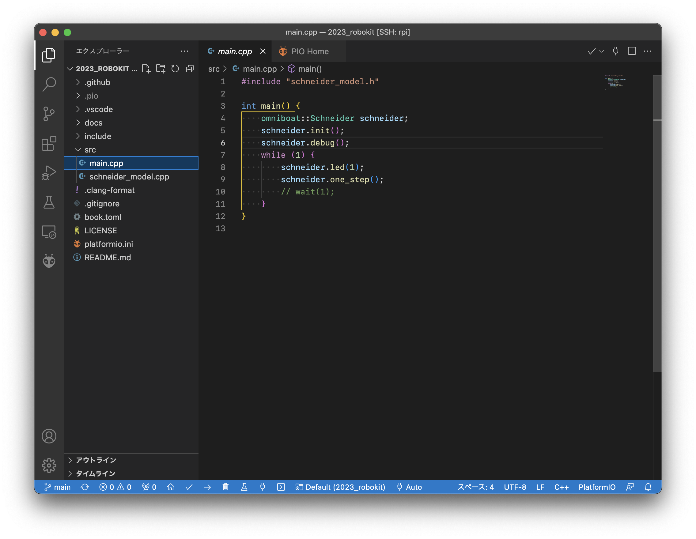

# コンパイル

このページでは、「コンパイル」とは何か、またその方法について説明します。

## コンパイルとは何か

私たちがコンピュータ上で計算を実行したいとき、まずは**プログラミング言語**と呼ばれる言語を用いて**プログラム**を記述します。プログラミング言語は日本語、英語といった自然言語とは違い、コンピュータが行う計算内容を記述するための言語です。ちなみに、ロボキットを動かすために使われているプログラミング言語はC++というものです。プログラミング言語の文法はとても厳密に定義されているため、1文字でもミスがあればコンピュータは思い通りに動いてくれません。(書いた通りに動く、とも言えます)

また、私たちが書いたプログラムはコンピュータにそのまま解釈されるわけではなく、一度**機械語**という別の言語に翻訳されます。この機械語は`1000110111011001...`といった`0`と`1`の列で表され、これを人間が記述するのは困難です。そのため、プログラミング言語で記述されたものを機械語に翻訳します。この翻訳を**コンパイル**といいます。

コンパイルを行うには、**コンパイラ**というソフトウェアを使用します。私たちは前ページの[環境構築](./04-environment-setup.md)で必要なコンパイラをすでに入手しています。

より詳しい説明は[コンパイラは翻訳ソフト - 苦しんで覚えるC言語](https://9cguide.appspot.com/01-02.html)を参照してください。

## コンパイルのやり方

> ここで紹介するのはコンパイル方法のあくまで1種です。動かしたいコンピューターの種類、扱っているプログラミング言語の種類などによってコンパイル方法は変わってきます。

まずは`src`フォルダ内にある`main.cpp`を開いてみてください。このようなウィンドウ表示になるはずです。

右上、または下のバー(*ステータスバー*といいます)にあるチェックマークを押すとコンパイルが始まります。`SUCCESS`と緑色の文字で表示されたらコンパイル成功です。
