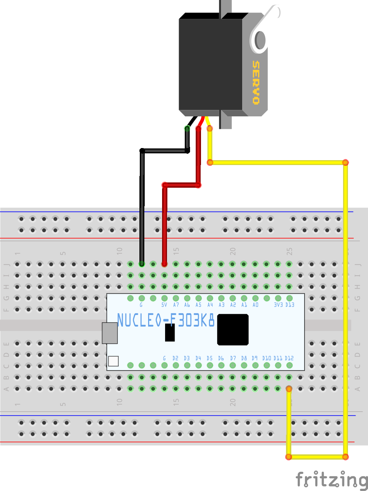

# サーボの原点合わせについて

ここでは[機体組み立て方法 #サーボホーンの取り付け](./03-construct-machine.md#サーボホーンの取り付け2つ作る)で言及したサーボの調整について説明します。

## PWM信号とサーボモーターの関係

オムニボートの頭脳となるマイコンは、繋がっている導線に電圧を与えることで各部品を動かしています。この電圧は0Vか3.3Vの2値(オン/オフ)しか選択できないため、例えば1Vの電圧などは出力できません。そこで扱われるのが**PWM**(Pulse Width Modulation)という技術です。

PWMでは、特定の周期でオンとオフを切り替えることによって擬似的に電圧を制御します。例えば、オンで3.3Vが出力される状況で、3.3s中1.0sだけオンにすると平均で1.0Vが得られます。このような、オンオフを切り替える1サイクルの間隔を**ピリオド**(Period)、オンとなっている時間を**パルス幅**(Pulse Width)と呼ぶことがあります。先ほどの例ではピリオドが3.3s, パルス幅が1.0sです。

サーボモーターは今紹介したPWM信号を用いて向きを制御するモーターです。今回用いるSG90というサーボモーターでは、ピリオドは20msで固定、パルス幅を変化させることでモーターの向きを変更します。パルス幅は1450usでモーターの向きが0°になります。

参考:

- [パルス幅変調 - Wikipedia](https://ja.wikipedia.org/wiki/%E3%83%91%E3%83%AB%E3%82%B9%E5%B9%85%E5%A4%89%E8%AA%BF)
- [PWM（パルス幅変調） - MATLAB & Simulink](https://jp.mathworks.com/discovery/pulse-width-modulation.html)
- [PWMとは | 東芝デバイス＆ストレージ株式会社 | 日本](https://toshiba.semicon-storage.com/jp/semiconductor/knowledge/e-learning/brushless-motor/chapter3/what-pwm.html)

## サーボリセット用のプログラム

ここからは[プログラミング環境構築](./04-environment-setup.md)を既に済ませていることが前提となります。[3: プログラムを開く](./04-environment-setup.md#3-プログラムを開く)で展開したzipファイルの中に、`examples`という名前のフォルダがあります。そのフォルダの中にある`reset-servo`という名前のフォルダをVSCodeで開いてください。

[コンパイル](./05-compile.md)および[アップロード](./06-upload.md)の手順に従ってプログラムのコンパイル、アップロードをすると適切なプログラムがマイコンに書き込まれます。このプログラムでは`PB_4`のピンにサーボモーターの向きを0°にするPWM信号を送ります。

## 配線

ここでは簡単のため、ブレッドボードを使用してマイコンとサーボを繋げる方法を紹介します。ブレッドボードとは、以下の引用に示されるようなものです。

> [ブレッドボードの使い方-電子工作とメモ](https://denshi-kousaku.nazotoki-k.com/kiso/eic-801.htm)
>
> ---
>
> 
>
> ---
>
> 
>
> ブレッドボードとはソケット（穴）に部品を差し込むだけで電子回路の試作・実験ができるたいへん便利なものです。 写真を見ただけでは使い方が解りづらいかもしれませんが、各ソケットは図の薄いオレンジ色の帯びで記してあるように内部でつながっています。 これを頭に入れて回路を組みます。

このブレッドボードを用いて、以下のように配線を行います。

この状態でプログラムをアップロードしたマイコンに電源を入れるとサーボの角度がリセットされます。
