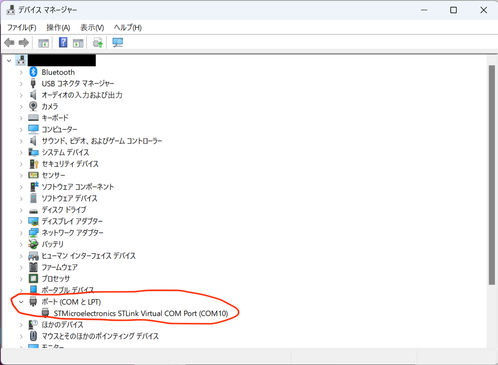

# トラブルシューティング

主にプログラミング関連のトラブルシューティングです。

## `ld returned 1 exit status` でコンパイルができない

**考えられる原因**

(Windowsを前提としています)

パス(ファイルの場所を示す文字列)に日本語が含まれている可能性があります。例えばOneDriveの`ドキュメント`フォルダーの中にPlatformIOのプロジェクトを置いた場合、パスは`C:\\Users\[username]\OneDrive\ドキュメント\omniboat_robokit\...`のようになります。

**解決方法**

`C:\\Users\[username]\Documents\omniboat_robokit`など、パスに日本語が含まれない場所に置いてください。

## ロボットが上手く動かない

- はんだ付けはできているか
- 足りないパーツはないか
- [サーボの原点合わせ](./07-reset-servo.md)を忘れていないか

まずはこういった、機械・回路の原因を検討してみてください。それでも解決しない場合は、以下の方法をお試しください。

コンパイル済みのバイナリを書き込みます。[こちらのリンク](https://drive.google.com/file/d/1A-GmEBmITawD9EEdCJXiHqHr3O2xWvZD/view?usp=share_link)から書き込むバイナリをダウンロードしてください。マイコンをパソコンに差し直すとマイコンがUSBデバイスとして認識されるので、ダウンロードしたファイルをその中にコピーしてください。コピーが完了したら自動的にプログラムが起動します。

## OpenOCDのエラーが出る

Windowsでマイコンへのアップロードを行っている時に発生するエラーです。ST-Linkのドライバがインストールされていない可能性があります。以下の手順を試してみてください。

1. [ドライバのダウンロードページ](https://www.st.com/en/development-tools/stsw-link009.html) を開く
2. `Get Software`を押して、ドライバのインストーラをダウンロードする
    - アカウント登録を求められます、新規登録をお願いします🙏
3. zipファイルがダウンロードされるので展開する
4. 展開されたものの中に`dpinst_amd64`というファイルがあるのでこれを開く
    - これは64ビットのWindowsでの手順です
    - 32ビットの場合は`dpinst_x86`というファイルを開いてください
5. インストーラが起動してドライバがインストールされる

パソコンを再起動した後に再度アップロードを試してみてください。それでもアップロードができない場合は、接続したデバイスに対してドライバが正しく割り当てられているかを確かめる必要があります。確認手順は以下の通りです。

1. デバイスマネージャーを開く
    1. キーボードのWinボタンを押す
    2. `device manager`で検索
2. マイコンに対応するデバイスを探す
    - 下のスクリーンショットを参考にしてください(ドライバが正しく割り当てられている場合のものです)
        
3. ドライバーを更新する
    1. デバイスを選択
    2. `ドライバーを自動的に検索`を実行
